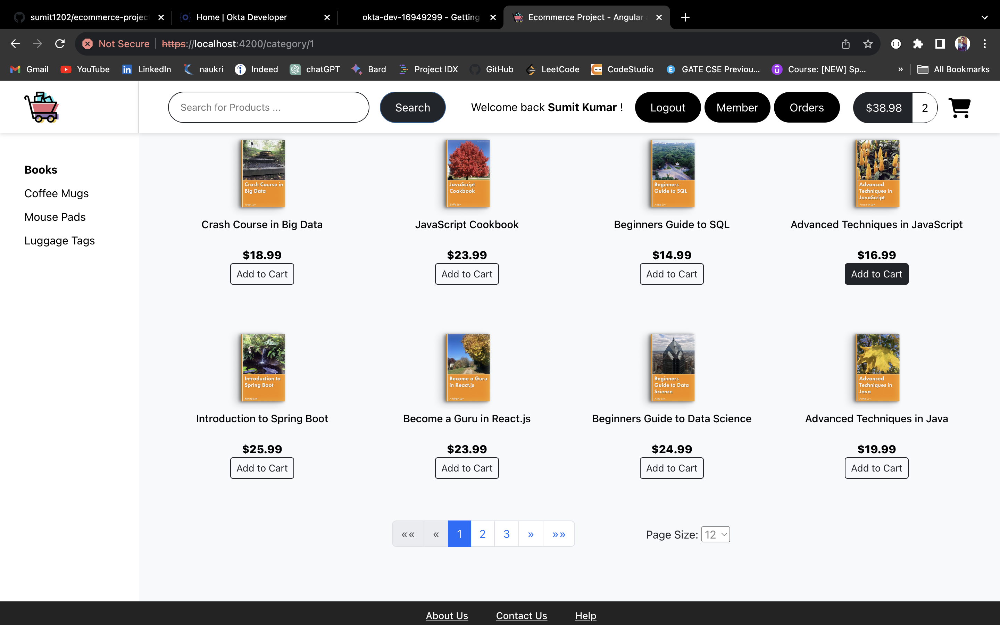

# My E-Commerce Shop

A Full-Stack E-Commerce Project developed using Angular as Frontend, Spring Boot as Backend, and MySQL as Database.



## Features

- Browse products by category
- View product details
- Search for a product
- Pagination
- Add product to your cart
- Check your final cart status - total price and quantity
- Increment or Decrement quantity of product in your cart
- Remove product from your cart
- Cart checkout
- Checkout form with validation
- Purchase - save order details to database
- Orders history
- Login/Logout - Secured Authentication and Authorization via Okta-OIDC-Oauth2
- Protected 'Member' page, only for logged in users
- Secured Rest API endpoints with Okta-jwt
- HTTPS enabled for backend and frontend

## Development server

Frontend Dev Server:

- In terminal change directory to `03-frontend-angular/ecommerce-angular`. Run `npm start` for a frontend dev server. Navigate to `https://localhost:4200/`. The application will automatically reload if you change any of the source files.

```
> cd 03-frontend-angular/ecommerce-angular
> npm start
```

Backend Dev Server:

- Run required MySQL Scripts to setup database.

- In another terminal change directory to `02-backend-springboot/ecommerce`. Run `./mvnw spring-boot:run` for a backend dev server. Navigate to `https://localhost:8443/api`. The application will automatically reload if you change any of the source files.

```
> cd 02-backend-springboot/ecommerce
> ./mvnw spring-boot:run
```

## Courtesy

[Full Stack: Angular and Java Spring Boot E-Commerce Website](https://www.udemy.com/course/full-stack-angular-spring-boot-tutorial/) - Udemy Course by Chad Darby and Harinath Kuntamukkala.
